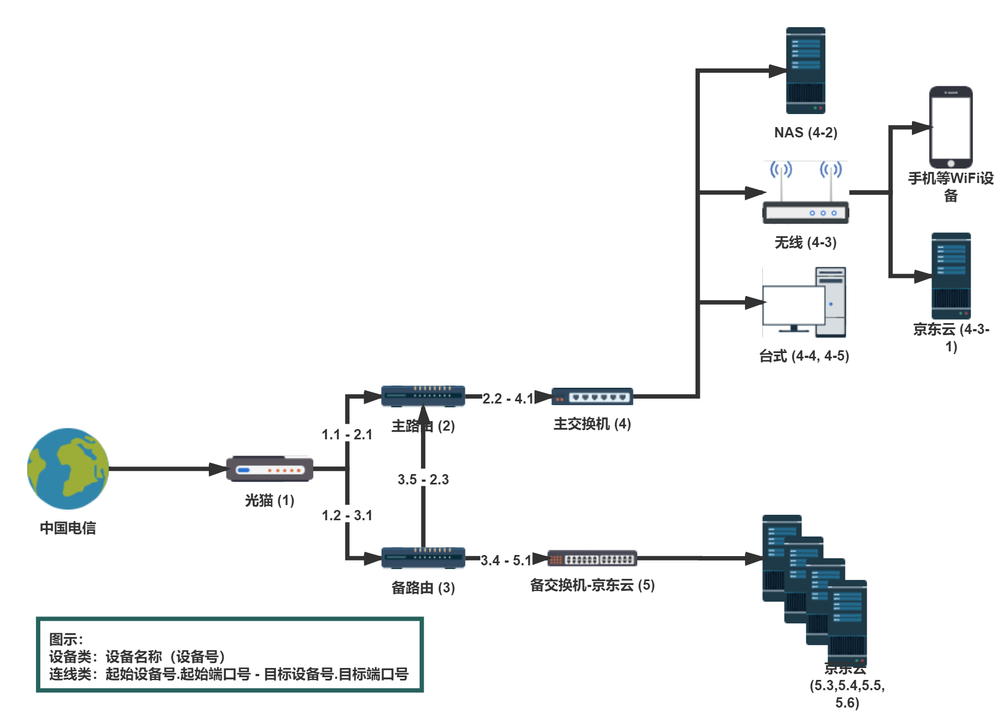
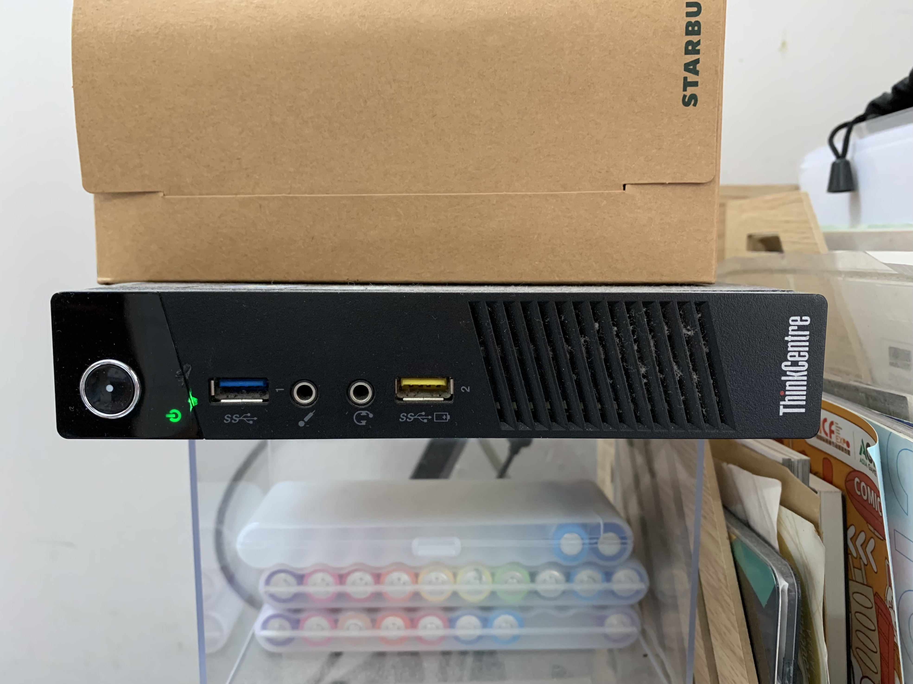
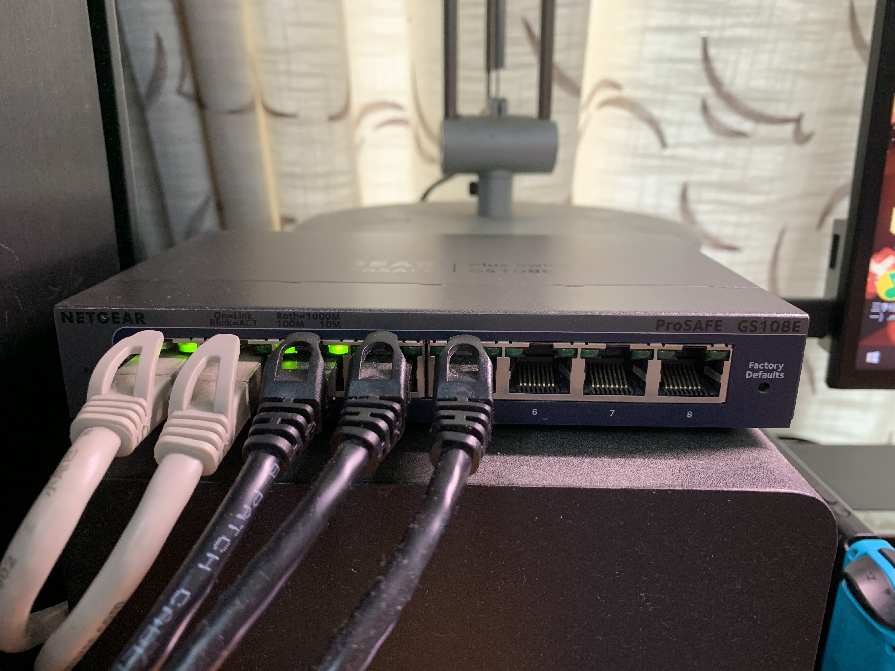

# 网络拓扑图

### 读懂拓扑图

拓扑图中主要分为两大组成，分别为：**设备**以及**连线**。

设备部分命名规则为**设备名称（设备编号）**。如**光猫 \(1\)**表示光猫为1号设备。

连线明明规则为**起始设备号.起始端口号 - 目标设备号.目标端口号**。如**1.1 - 2.1**表示从1号设备（光猫）的1号端口连接到2号设备（主路由）的1号端口。PS. 虽然网线并不区分起点端与终点端，但是为了方便联系俺请按端口号进行连接。

### 设备实物对照图以及端口号示意图

#### 光猫 \(1\)

#### 主路由 \(2\)

#### 备路由 \(3\)

**注意：1号端口在机器上标识为Internet**

#### 主交换机 \(4\)

无线 \(4-3\)

台式 \(4-4, 4-5\)

备交换机-京东云 \(5\)

